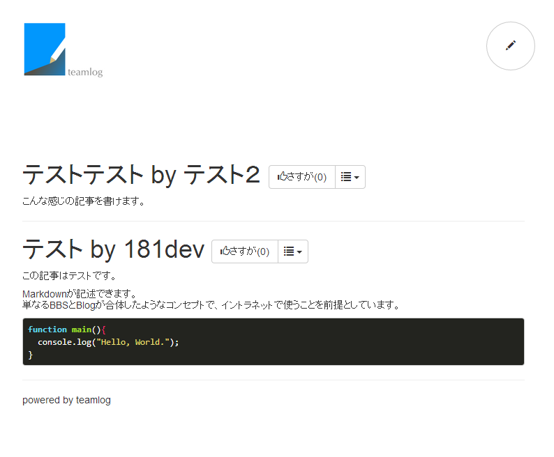

teamlog
=======

最低限の機能を持つチームブログエンジン。



[](https://heroku.com/deploy)

Require
-------

 * MongoDB
 * Nodejs 0.10+

Usage
----------

インストール

```
$ git clone https://github.com/181dev/teamlog.git
$ cd teamlog
$ npm install
```

実行ディレクトリに.envファイルを配置します。内容は下記の通りです（ローカルのMongoDBを使う場合）

```
MONGODB_URL=mongodb://localhost:27017
```


実行

```
$ npm start
```

http://localhost:3000/を参照します。


TODO
----------

 * 簡易ログイン機能
 * Markdown Preview

